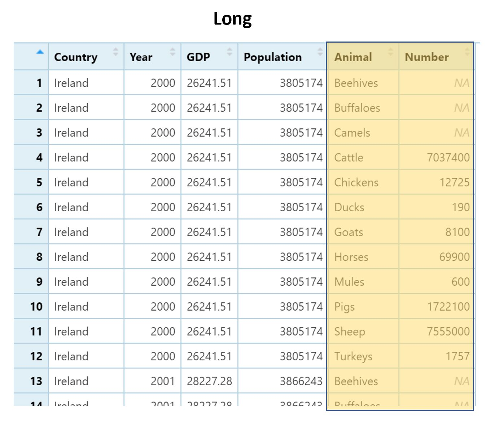

# Merging and Reshaping data

```{r setup,include=FALSE}
library(dplyr)
library(ggplot2)
library(tidyr)
library(learnr)

UKIreland<-read.csv("UKIreland.csv")

Livestock<-read.csv("UN_LivestockData.csv")


```


## Overview

This tutorial gives a short introduction to some very useful data manipulation processes:

Merging datausing he `_join()` functions from within the `dplyr` library

Reshaping data using the `pivot_()` functions from the `tidyr` library

These functions can be incredibly useful for bringing together data from multiple sources into a consistent tidy format ready for analysis. Trying to replicate this sort of functionality in Excel is extremely time-consuming and has high potential for human error.

This tutorial provides just a few examples, to show how the code works, but links are provided to more extensive resources if this is something you are interested in learning more about.

## Data for this session

In this session my ultimate objective will be to make a plot comparing per-capita numbers of pigs, sheep and cows over time between the UK and Ireland.

To get to this point I have two data sets which I will need to combine and manipulate:

1. `UKIreland`, which has population data for the UK and Ireland between 2000 and 2018


2. `Livestock`. This has data for the numbers of various different types of livestock, for all countries in the world, between 2000 and 2018.


## Full joins

dplyr has a number of clever functions for merging data. In all cases we need to have two data frames which share a common ID variable or variables. In this session we will cover two of the key ones `full_join()` and `inner_join()`


`full_join()` will give us an output data frame which contains all of the rows from both datasets we are trying to merge, whether or not there is a match in the corresponding data or not. If there is no match, missing values will be filled in for the columns from the corresponding data frame.


```{r echo=FALSE, out.width="90%", fig.align='center'}

```


We need to provide the names of two data frames, and then the argument "by" to provide the common ID variable or variables. In this case we have two common ID variables - "Country" and "Year" that we need to match.

Using `full_join` with the `UKIreland` data with the `Livestock` data will give an output that contains rows for all countries and the columns from both data frames. 


```{r fj,exercise=TRUE}
full_join(UKIreland,Livestock,by=c("Country","Year"))
```
However, except for the UK and Ireland, there will missing values within the `GDP` and `Population` columns, since these came from the `UKIreland` data.
You can see from the output there are 3416 rows in total within this data and 16 columns. The same as the original `Livestock` data.

But look what would have happened if we had incorrectly specified the ID columns - by only joining by "Country" and not joining by "Year".

```{r fj2,exercise=TRUE}
full_join(UKIreland,Livestock,by="Country")
```
There are two differences in the output - you can see we have more rows, 3960, and also more columns, 17.
Because both data had a "Year" column, but it was not used as a matching variable, there are now two "Year" columns in the joined data "Year.x" and "Year.y". And the rows have increased because we are matching every combination of our countries from the first data with the second data. So for the Irish population and GDP in 2000, from `UKIreland` we have 17 rows - one for each year of `Livestock`. And again 17 rows for 2001, 2002 and so on. 

```{r echo=FALSE, out.width="90%", fig.align='center'}

```


This is almost certainly not what we want! It is always good to check the dimensions and structure of merges after writing code, to ensure errors like this do not creep in.

## Inner joins

`inner_join()` will give us an output data frame which only contains the rows that match.

```{r echo=FALSE, out.width="90%", fig.align='center'}

```

So with our example it will only include the UK and Ireland. No new missing values are created during an `inner_join`. 


```{r ij, exercise=TRUE}
inner_join(UKIreland,Livestock,by=c("Country","Year"))

```
There are missing values in the joined data - but these were present in the original data as well. There is something of a lack of camels or buffalos which are kept as livestock in the UK or Ireland! 

In this case, this is probably what I want so I am going to save an object of the merged data, called `MergedData`, to use in the next steps.

```{r assign, exercise=TRUE}
MergedData<-inner_join(UKIreland,Livestock,by=c("Country","Year"))

summary(MergedData)

```
I could have got to the same point here if I used a `filter()` after the `full_join()` but it seems more efficient to use the `inner_join()` instead!

## More complex joining

These two join functions provide functionality which will cover most of the commonly needs you would have for merging two data sets together.
But there are several other ways of merging data together in dplyr with different `_join()` functions, which are worth being aware of for other situations.

There is a comprehensive tutorial on all the different joining functions in `dplyr` here:
https://rpubs.com/williamsurles/293454


## Going long

The data for cattle numbers, from `Livestock` (and now also the new object `MergedData`) is in what is known as "Wide" format. There is one column for each kind of animal. 

```{r echo=FALSE, out.width="90%", fig.align='center'}

```


But this is not the format which R generally likes to operate on - R much prefers "long" format. Here we have one column for each "attribute". We would consider "type of animal" to be one attribute, and "number of animals" to be another attribute. 

```{r echo=FALSE, out.width="90%", fig.align='center'}

```


If you think to when we have used `ggplot2`, we have a column in our data for grouping variables, for facets, or different colours and it is similar for summarising data from `dplyr` where we `group_by()` this type of column. 
So in this example, in order to make some nice plots I need one column which is a grouping variable for `Animal` and one variable which is the `Number` of that animal. 

The `pivot_longer()` function from the `tidyr` library allows us to do this. 

```{r gather0,exercise=TRUE}
MergedData %>%
  pivot_longer(cols=Beehives:Turkeys , names_to="Animal",values_to="Number")
```

If we pipe into the function, we need to supply three arguments:

Which columns need to be reshaped. This argument is called "cols". We don't want all of the columns - we only want the ones which refer to animals. We could manually name each column we would like, or in this case where the columns we want are sequential we can use a shortcut by using a colon and saying `FirstColumn:LastColumn`. The first column of animals is `Beehives` and the last is `Turkeys`. We do not need to use quotation marks when referencing existing columns. 

The name of the new column where the existing column names will be placed in the restructured data. This argument is called "names_to" - it requires an input within quotation marks. In this case the columns are different animals, so we can call it "Animal".

The name of the new column where the data values will be placed in the restructured data. This argument is called "values_to" - it requires an input within quotation marks. In this case the values refer to numbers of each animal, so we can call it "Number".

If I wasn't using a pipe, the first argument of this function would need to be the dataframe.


Note that this new data has 408 rows - 1 row for each animal within each country within each year. But only 6 columns,
The previous data had just 34 rows - 1 row for each country within each year. But 16 columns, because each animal had it's own column. 

In RStudio, you could see this in the environment pane; or by using the `dim()` function to get the dimensions. I am going to assign the previous step into a new object and then check this.


```{r gather1, exercise=TRUE}
LongData<- MergedData %>%
  pivot_longer(cols=Beehives:Turkeys , names_to="Animal",values_to="Number")

dim(LongData)
dim(MergedData)
```

Having the data in long format makes it much easier to analyse, plot or manipulate.

Remember that I wanted to calculate the rates of different animals per capita? I could have done this in the original wide format, creating a new column for every single type of animal. But in long format I only need to do this once - dividing `Number` by `Population`.

```{r gather2, exercise=TRUE}
LongData %>%
    mutate(NumberPerCapita=Number/Population)
```
Now that I have this we can make my comparison of cows, sheep and pigs per capita over time in the UK and Ireland. But there are a lot more animals than that, so first I need to use a `filter()`. The  `%in%` operator is very useful to select just these animals, and after I have filtered I can pipe in to make a plot.

```{r plot1, exercise=TRUE}
LongData %>%
    mutate(NumberPerCapita=Number/Population) %>%
      filter(Animal%in%c("Cattle","Sheep","Pigs")) %>%
        ggplot(aes(y=NumberPerCapita,x=Year,col=Country))+
          geom_line()+
            facet_wrap(~Animal)
```
Adjusting per capita makes it easy to have a fairer comparison of livestock numbers between these two very different sized countries, and plotting in this way quite clearly shows my the trends over time, and between countries and between animals. I am now slightly worried about the declining sheep population in Ireland!

## Going wide


If I wanted my data back to the original format, but including the new per capita numbers as well as the total numbers, I could reshape it back to wide format using `pivot_wider()`. 

The `pivot_wider()` function is in effect the reverse of the `pivot_longer()`. So it requires the reverse inputs:
The names column from which each unique value in this column will become one of the column names in the new data. This argument is "names_from".
The value column from the data - which will make up the contents of these new columns. This argument is "values_from".

So in this case the "names_from" column is `Animal`
Now that we have created the `NumberPerCapita` column we have two columns of values. So we will use the `c()` function within the "values_from" argument to provide both the `Number` and `NumberPerCapita` columns,


```{r gather3, exercise=TRUE}
LongData %>%
    mutate(NumberPerCapita=Number/Population) %>%
      pivot_wider(names_from=Animal,values_from=c(Number,NumberPerCapita))
```
You can see that the dimensions of this new data - 34 rows and 28 columns. We now have two columns for each animal - one with the prefix "Number_" and another with a prefix "NumberPerCapita". And we are back to the original 34 rows - one for each country within each year.


## More complex transformations

Like the `_join()` set of functions, the `pivot_()` set of functions have lots of extensions, which can allow for lots of flexibility in reshaping your data.
If you are interested in learning more about this, a tutorial can be found here: https://tidyr.tidyverse.org/articles/pivot.html
